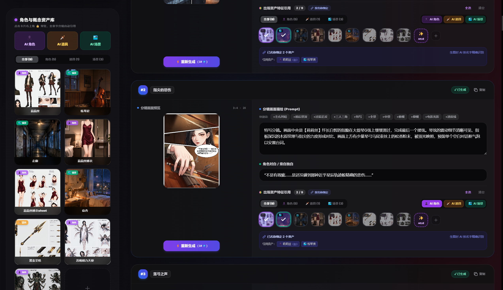
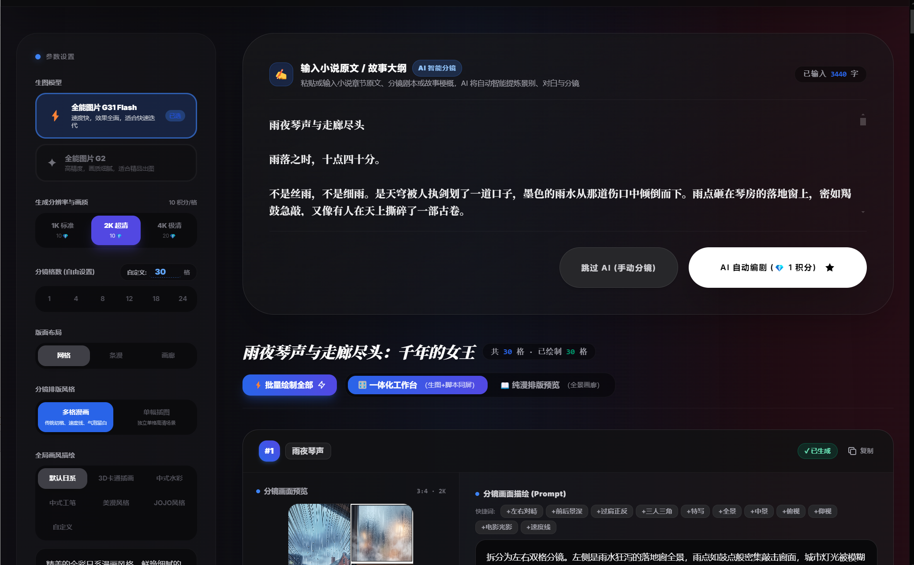
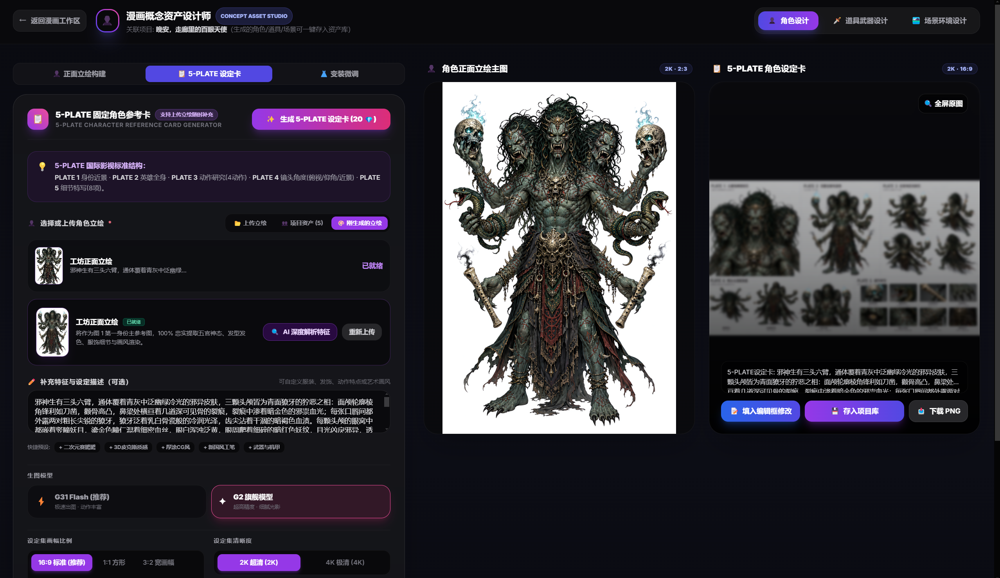
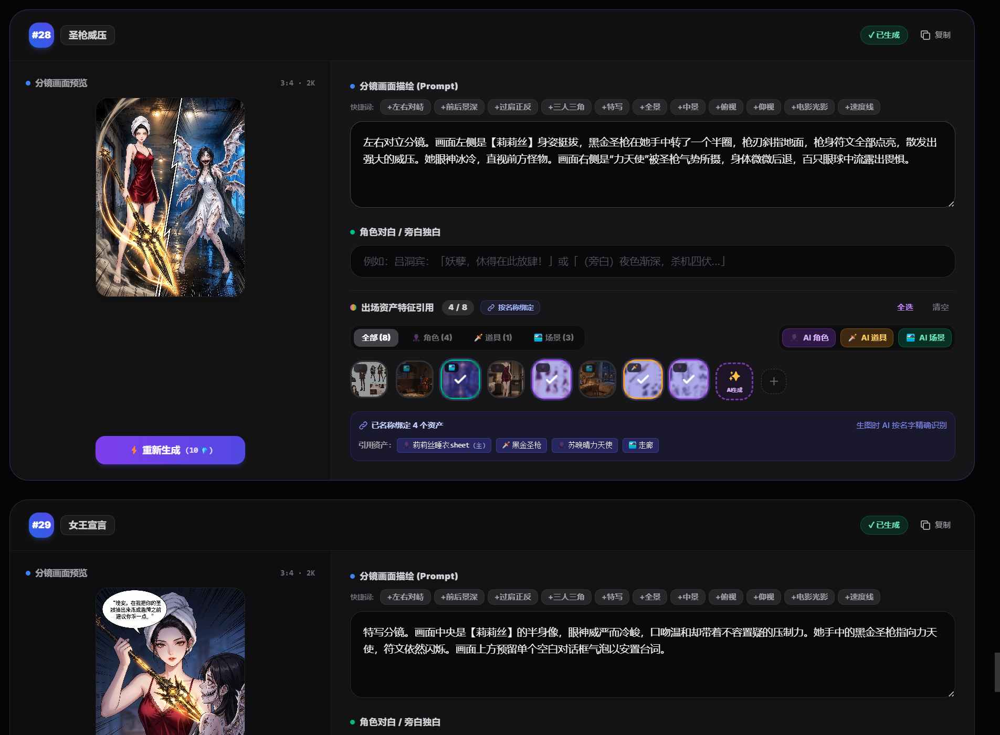
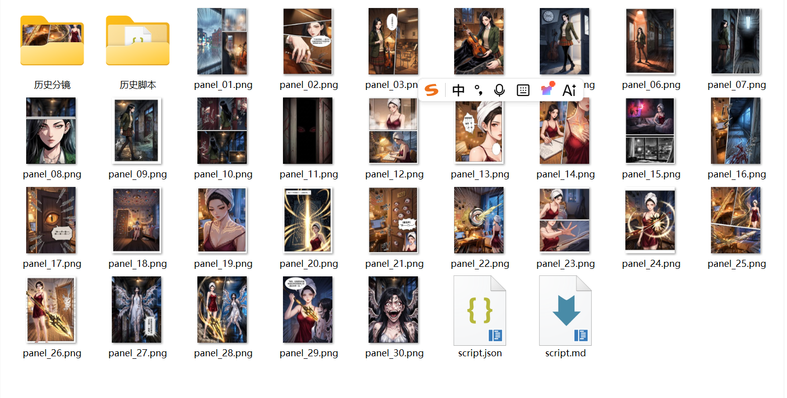

<div align="center">

<a href="https://www.bilibili.com/video/BV1HPhc6EEA5" target="_blank">
  
</a>

# 漫刻 AI · 智能漫画生成工坊

**粘贴小说章节 · 自动分镜 · 全彩出图 · 角色一致 · 4K 画质**

</div>

---

## 一、软件介绍

漫刻 AI 是一款 AI 漫画创作桌面应用。你只需把小说章节原文粘贴进去，它就能自动拆成分镜剧本，再一键生成全彩漫画画面。从角色设定到成品漫画，整个流程一个应用搞定，不需要在多个工具之间来回切换。

### 创作流程

```
① 新建作品 & 章节
        ↓
② 角色工坊画设定卡      角色立绘 → 5-PLATE 设定卡 → 存入项目
   （道具、场景同理）      一次设定，所有分镜通用
        ↓
③ 粘贴小说章节原文       AI 通读全文 → 提炼 1~32 格分镜
   （或手动输入剧本）      每格含画面描述 · 角色站位 · 台词
        ↓
④ 绑定角色 & 批量出图     分镜关联角色 → 单格精绘 / 一键批量
   （1K / 2K / 4K）        角色特征保持一致
        ↓
⑤ 自动归档 & 导出        自动存入本地文件夹 / 一键打包
```

---

## 二、功能介绍

### 2.1 粘贴小说，自动分镜

把小说章节原文贴进输入框，AI 会通读全文，自动提炼出关键剧情节点，拆成 1~32 格分镜。每格分镜自带画面描述、角色站位和台词，覆盖故事从开头到结尾的完整脉络。

- 支持 1 / 4 / 8 / 12 / 18 / 24 / 32 格分镜
- 分镜均匀覆盖故事开头到结尾，不只是取前半段
- 可手动精修每格画面描述、指定出场角色、微调台词
- 也支持跳过 AI，直接手动输入剧本

<!-- 截图位置：分镜编辑器 / 编剧界面 -->


### 2.2 漫画资产库：角色、场景、道具生成

内置 AI 概念资产工坊，三类资产全覆盖：

- **角色** — 生成纯白底正面立绘，再做 5-PLATE 设定卡（近景 + 全身 + 4 动作 + 3 视角 + 8 特写），存入项目后所有分镜自动保持角色一致
- **道具武器** — 核心机关微距、悬浮全貌、出鞘充能 4 状态、正侧俯透视拆解
- **场景环境** — 16:9 / 4:3 宽幅电影级背景主图，多视角空间纵深感

整套资产在作品下所有章节共享通用，画一次到处用。

<!-- 截图位置：角色设计工坊 / 5-PLATE 设定卡 -->


### 2.3 漫画产出选项

出图前可以自由组合分辨率、版式和风格，所有选项切换即生效。

**分辨率**

| 画质 | 适合场景 |
| :--- | :--- |
| 1K | 快速预览、试错调整构图 |
| 2K | 网络连载、手机平板高清阅读 |
| 4K | 商业出版、印刷母带级品质 |

**漫画版式**

| 版式 | 特点 |
| :--- | :--- |
| 多格分镜 | 传统漫画排版，带分格线、速度线、旁白框，多镜头并存 |
| 单幅大格 | 单张完整插画，专注单个场景的构图与光影表现 |

**漫画风格**

| 风格 | 特点 |
| :--- | :--- |
| 默认日系 | 全彩赛璐璐上色，鲜艳细腻，电影级光影 |
| 3D 卡通插画 | 迪士尼皮克斯 3D 风格，温润立体，糖果色调 |
| 中式水彩 | 水彩晕染与水墨效果，清新淡雅 |
| 中式工笔 | 工笔白描线条，典雅古典上色 |
| 美漫风格 | DC / Marvel 风，厚重墨色阴影，网点纹理 |
| JOJO 风格 | 戏剧化姿势，交叉排线，高对比度鲜艳色彩 |

出图支持单格精绘和一键批量整话生成，画好的可全屏灯箱查看，键盘左右键切换。

<!-- 截图位置：4K 画质生成效果 / 灯箱查看 -->


### 2.4 作品项目管理

采用「作品 → 章节 → 分镜」三级结构。一部作品可以无限创建章节，适合连载漫画创作。角色、道具、场景资产在所有章节共享通用，不用重复设定。

首页项目库一目了然，随时回顾、管理和归档创作历史，支持自定义作品封面。

<!-- 截图位置：项目库 / 章节管理界面 -->


### 2.5 自动本地存储

生成好的漫画图片可以自动写入你指定的本地文件夹，不用手动一张张下载。也支持一键打包导出全部画格，直接调起系统资源管理器定位文件。

就算断网或刷新页面，作品数据也不会丢——所有内容自动缓存在本地，随时可以继续创作。

<!-- 截图位置：导出菜单 / 本地文件夹 -->


---

<div align="center">

**QQ群** · 问题反馈
QQ群：117294884
</div>

<div align="center">

**漫刻 AI** · 让每个人都能创作专业级漫画

</div>
